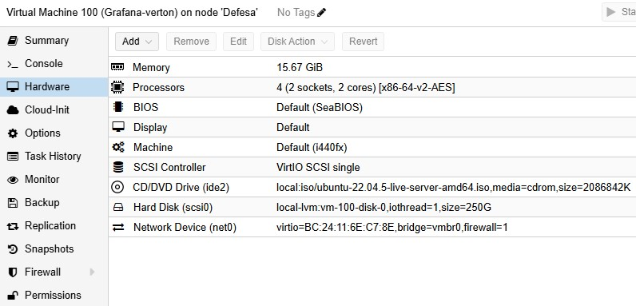
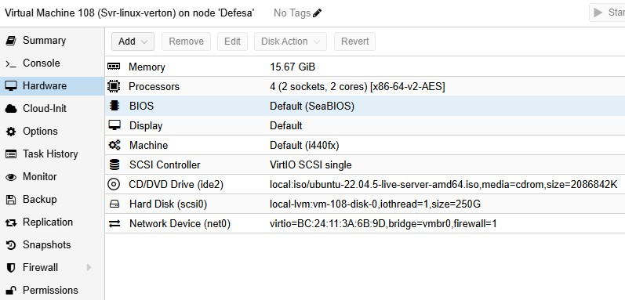
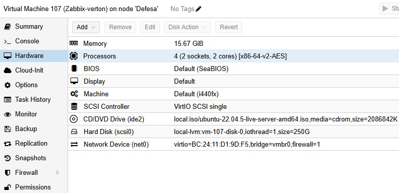
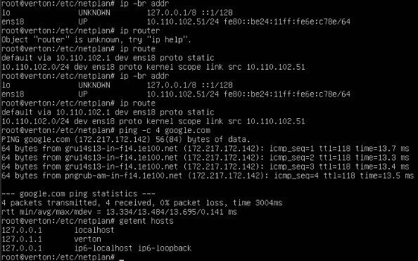
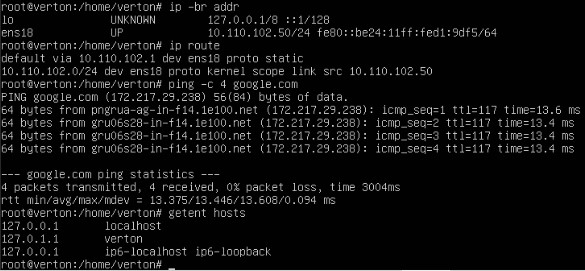
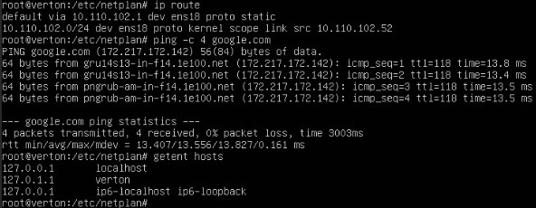

# Projeto Operação NOC — Repositório Modelo

> **Investigação, Monitoramento e Observabilidade de Redes**  
> Ubuntu Server + Redes + Wireshark + Zabbix + Grafana

## Identificação

| Campo | Exemplo |
|---|---|
| Aluno(a) / Grupo | weverton |
| Turma | Defesa Cibernética — 2026 |
| Professor | Frank Philson |
| Data | 14/09/2026 |
| Rede do laboratório | `10.110.102.0/22` |

## Objetivo

Implementar e documentar um laboratório de **Network Operations Center (NOC)** capaz de monitorar disponibilidade, serviços e recursos, combinando diagnóstico de rede, análise de pacotes, monitoramento com Zabbix e visualização no Grafana.

> **Regra operacional utilizada:** primeiro observar e coletar evidências; depois formular a hipótese, corrigir, validar e documentar.

## Ambiente de referência

| Hostname | IP | Função |
|---|---:|---|
| `ZABBIX01` | `10.110.102.50` | Zabbix Server + MariaDB + Frontend |
| `GRAFANA01` | `10.110.102.51` | Grafana |
| `SRV-LINUX01` | `10.110.102.52` | Servidor monitorado |
| Gateway | `10.110.102.1` | Saída da rede do laboratório |

> As imagens abaixo são **ilustrações didáticas**. O aluno deve substituir pelas evidências reais do próprio laboratório.

## Sumário

- [Fase 01 — Planejamento e endereçamento](#fase-01--planejamento-e-enderecamento)
- [Fase 02 — VMs e sistemas operacionais](#fase-02--vms-e-sistemas-operacionais)
- [Fase 03 — IP estático e conectividade](#fase-03--ip-estatico-e-conectividade)
- [Fase 04 — Preparação Linux](#fase-04--preparacao-linux)
- [Fase 05 — Serviços SSH e HTTP](#fase-05--servicos-ssh-e-http)
- [Fase 06 — Diagnóstico manual e Wireshark](#fase-06--diagnostico-manual-e-wireshark)
- [Fase 07 — Zabbix Server](#fase-07--zabbix-server)
- [Fase 08 — Hosts e Zabbix Agent 2](#fase-08--hosts-e-zabbix-agent-2)
- [Fase 09 — Monitoramento no Zabbix](#fase-09--monitoramento-no-zabbix)
- [Fase 10 — Grafana](#fase-10--grafana)
- [Fase 11 — API Zabbix](#fase-11--api-zabbix)
- [Fase 12 — Integração Grafana + Zabbix](#fase-12--integracao-grafana--zabbix)
- [Fase 13 — Dashboard NOC](#fase-13--dashboard-noc)
- [Fase 14 — Segurança](#fase-14--seguranca)
- [Fase 15 — Simulação de incidentes](#fase-15--simulacao-de-incidentes)
- [Fase 16 — Evidências e documentação final](#fase-16--evidências-e-documentacao-final)
- [Conclusão](#conclusão)
- [Checklist final](#checklist-final)

---

## Fase 01 — Planejamento e endereçamento

### Objetivo
Definir rede privada, CIDR, gateway, DNS, IPs e hostnames.

### Execução do exemplo
Foi escolhida a rede privada `10.20.30.0/24`, evitando sobreposição com outras redes do laboratório.

### Checkpoint
**Tabela de endereçamento preenchida e diagrama da rede.**

### Evidências registradas
- Topologia/CIDR
- Tabela de IPs e hostnames
- Justificativa da faixa escolhida


---

## Fase 02 — VMs e sistemas operacionais

### Objetivo
Criar as três VMs e instalar o sistema operacional.

### Execução do exemplo
Foram criadas três VMs Ubuntu Server 24.04 com 4 vCPU, 16 GB de RAM e 100 GB de disco cada.

### Checkpoint
**ZABBIX01, GRAFANA01 e SRV-LINUX01 inicializados.**

### Evidências registradas
- Tela das VMs
- CPU/RAM/disco
- Sistema operacional instalado





---

## Fase 03 — IP estático e conectividade

### Objetivo
Configurar IPs estáticos, rota, gateway e DNS.

### Execução do exemplo
Os três servidores receberam IP estático e foram validados com `ip -br addr`, `ip route`, ping e resolução DNS.

**Comandos/itens de validação:** `ip -br addr` • `ip route` • `ping` • `getent hosts`

### Checkpoint
**As três VMs devem se comunicar e resolver nomes.**

### Evidências registradas
- ip -br addr
- ip route
- ping entre VMs
- resolução DNS




---

## Fase 04 — Preparação Linux

### Objetivo
Padronizar hostname, atualizar pacotes e validar horário/NTP.

### Execução do exemplo
Os hostnames foram padronizados, os pacotes foram atualizados e o fuso horário foi definido para `America/Sao_Paulo`.

**Comandos/itens de validação:** `hostnamectl` • `timedatectl` • `apt update`

### Checkpoint
**Hostnames corretos e relógios sincronizados.**

### Evidências registradas
- hostnamectl
- timedatectl
- apt update/upgrade


---

## Fase 05 — Serviços SSH e HTTP

### Objetivo
Disponibilizar SSH e Apache no SRV-LINUX01.

### Execução do exemplo
No `SRV-LINUX01`, SSH e Apache foram instalados, habilitados e testados local e remotamente.

**Comandos/itens de validação:** `systemctl status ssh` • `systemctl status apache2` • `curl`

### Checkpoint
**Portas 22 e 80 acessíveis pela rede do laboratório.**

### Evidências registradas
- systemctl status ssh
- systemctl status apache2
- ss -lntp
- curl


---

## Fase 06 — Diagnóstico manual e Wireshark

### Objetivo
Registrar o baseline e analisar protocolos antes do monitoramento automático.

### Execução do exemplo
Foi registrado o baseline da rede e capturados ICMP, ARP, DNS, TCP e TLS. O three-way handshake foi identificado.

**Comandos/itens de validação:** `icmp` • `arp` • `dns` • `tcp` • `tls`

### Checkpoint
**Capturas de ICMP, ARP, DNS, TCP e TLS.**

### Evidências registradas
- Filtros utilizados
- Three-way handshake TCP
- ICMP/ARP/DNS
- TLS/HTTPS


---

## Fase 07 — Zabbix Server

### Objetivo
Instalar MariaDB, Zabbix Server, frontend e Agent 2 no ZABBIX01.

### Execução do exemplo
No `ZABBIX01`, MariaDB, Zabbix Server, frontend Apache/PHP e Agent 2 foram instalados e validados.

**Comandos/itens de validação:** `systemctl status zabbix-server` • `ss -lntp`

### Checkpoint
**Frontend funcionando e serviços ativos.**

### Evidências registradas
- Serviços ativos
- Portas 80/10050/10051
- Tela do frontend


---

## Fase 08 — Hosts e Zabbix Agent 2

### Objetivo
Instalar/configurar Agent 2 e cadastrar SRV-LINUX01 no Zabbix.

### Execução do exemplo
O `SRV-LINUX01` foi cadastrado como host e o Agent 2 passou a enviar métricas para o Zabbix.

**Comandos/itens de validação:** `systemctl status zabbix-agent2` • `Latest data`

### Checkpoint
**Host disponível e enviando métricas.**

### Evidências registradas
- Host cadastrado
- Agent 2 ativo
- Latest data


---

## Fase 09 — Monitoramento no Zabbix

### Objetivo
Monitorar disponibilidade, serviços e recursos.

### Execução do exemplo
Foram validados ICMP, HTTP, CPU, memória, disco, rede, uptime e a visão de Problems.

**Comandos/itens de validação:** ICMP • HTTP • CPU • memória • disco • RX/TX • Problems

### Checkpoint
**ICMP, HTTP, CPU, memória, disco, rede e Problems validados.**

### Evidências registradas
- ICMP
- HTTP
- CPU/memória/disco
- Problems


---

## Fase 10 — Grafana

### Objetivo
Instalar e proteger o Grafana no GRAFANA01.

### Execução do exemplo
O Grafana foi instalado no `GRAFANA01` e o acesso ficou restrito à rede do laboratório.

**Comandos/itens de validação:** `systemctl status grafana-server` • porta `3000/TCP`

### Checkpoint
**Grafana ativo e acessível somente pela rede do laboratório.**

### Evidências registradas
- grafana-server
- porta 3000
- login funcional


---

## Fase 11 — API Zabbix

### Objetivo
Criar identidade de integração de somente leitura.

### Execução do exemplo
Foi criada a identidade `grafana_ro`, com permissão somente de leitura e token dedicado. O token real não foi publicado.

### Checkpoint
**Usuário e API Token dedicados criados.**

### Evidências registradas
- Usuário grafana_ro
- Permissão Read
- Token mascarado


---

## Fase 12 — Integração Grafana + Zabbix

### Objetivo
Instalar plugin Zabbix e criar o data source.

### Execução do exemplo
O plugin Zabbix foi habilitado e o data source `Zabbix-NOC` retornou `Save & test` com sucesso.

### Checkpoint
**Save & test concluído com sucesso.**

### Evidências registradas
- Plugin habilitado
- URL da API
- Save & test OK


---

## Fase 13 — Dashboard NOC

### Objetivo
Criar dashboard operacional.

### Execução do exemplo
O dashboard reúne disponibilidade dos hosts, CPU, memória, disco, rede, HTTP, uptime e problemas ativos.

### Checkpoint
**Painéis de disponibilidade, CPU, memória, disco, rede, HTTP e problemas.**

### Evidências registradas
- Dashboard completo
- Métricas com unidades
- Período de tempo coerente


---

## Fase 14 — Segurança

### Objetivo
Revisar firewall, SSH, privilégios e exposição de serviços.

### Execução do exemplo
As regras de firewall e os privilégios foram revisados, evitando exposição desnecessária de serviços e credenciais.

**Comandos/itens de validação:** `sudo ufw status numbered`

### Checkpoint
**Somente acessos necessários devem permanecer liberados.**

### Evidências registradas
- ufw status numbered
- Regras de acesso
- Sem segredos no repositório


---

## Fase 15 — Simulação de incidentes

### Objetivo
Provocar falhas controladas e investigar antes de corrigir.

### Execução do exemplo
Foi simulado Apache parado. O host permaneceu acessível por ICMP, mas o HTTP falhou; a causa foi confirmada e o serviço restaurado.

**Comandos/itens de validação:** `systemctl` • `journalctl` • `curl` • `ping`

### Checkpoint
**Incidente detectado, diagnosticado, corrigido e validado.**

### Evidências registradas
- Sintoma
- Evidência
- Hipótese/causa
- Correção
- Validação


---

## Fase 16 — Evidências e documentação final

### Objetivo
Consolidar o processo técnico realizado.

### Execução do exemplo
As evidências foram organizadas neste README, preservando o histórico técnico e removendo qualquer segredo.

### Checkpoint
**README completo, organizado e sem credenciais expostas.**

### Evidências registradas
- Evidências por fase
- Conclusão
- Dificuldades
- Melhorias futuras


---

## Conclusão

O laboratório permitiu acompanhar todo o caminho de uma operação NOC: planejamento, conectividade, diagnóstico de protocolos, implantação do monitoramento, construção de dashboards, aplicação de controles de segurança e investigação de incidentes. O principal aprendizado foi separar **conectividade, serviço e aplicação**: um host pode responder ICMP e, ainda assim, apresentar falha de SSH, HTTP ou coleta do agente.

Como melhoria futura, o ambiente pode receber HTTPS, autenticação centralizada, retenção de métricas ajustada, backups das configurações e integração com um projeto SOC/SIEM separado.

## Checklist final

- [x] Rede privada e tabela de IPs documentadas.
- [x] Três VMs instaladas e validadas.
- [x] IP, gateway, DNS e horário corretos.
- [x] SSH e HTTP funcionando.
- [x] Capturas de ICMP, ARP, DNS, TCP e TLS.
- [x] Zabbix Server e Agent 2 funcionando.
- [x] ICMP, HTTP, CPU, memória, disco e rede monitorados.
- [x] Grafana integrado ao Zabbix.
- [x] Dashboard NOC criado.
- [x] Regras de segurança revisadas.
- [x] Incidente controlado investigado e corrigido.
- [x] Nenhuma credencial real publicada.

## Estrutura deste repositório

```text
projeto-noc-modelo/
├── README.md
└── imagens/
    ├── fase01-planejamento.png
    ├── fase02-vms.png
    ├── fase03-conectividade.png
    ├── fase04-preparacao-linux.png
    ├── fase05-servicos.png
    ├── fase06-wireshark.png
    ├── fase07-zabbix-server.png
    ├── fase08-agent2.png
    ├── fase09-monitoramento.png
    ├── fase10-grafana.png
    ├── fase11-api-zabbix.png
    ├── fase12-integracao.png
    ├── fase13-dashboard.png
    ├── fase14-seguranca.png
    ├── fase15-incidentes.png
    └── fase16-evidencias.png
```

> **Importante:** este é um exemplo didático. Cada aluno deve usar os próprios IPs, prints, resultados e conclusões.
